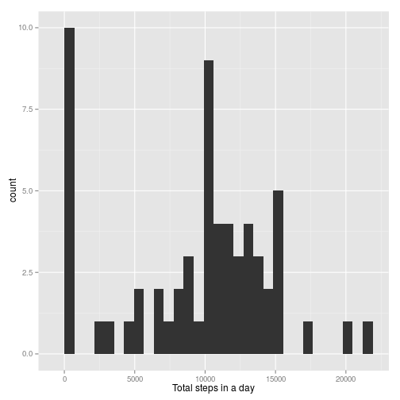
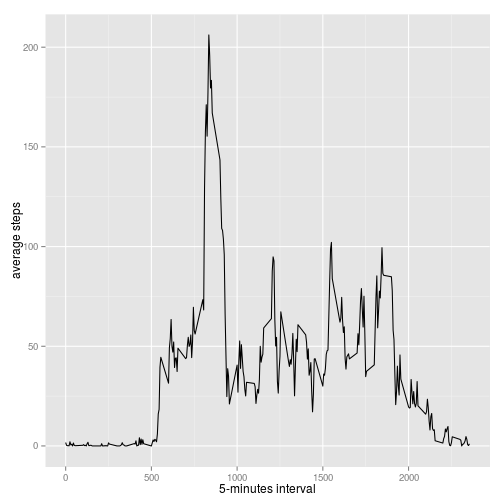
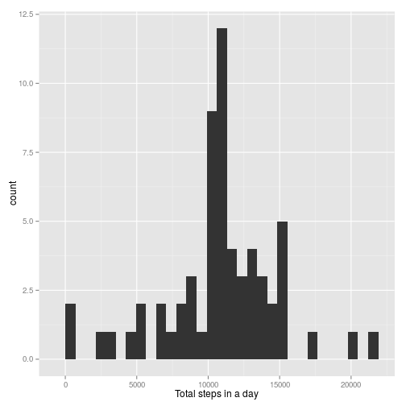
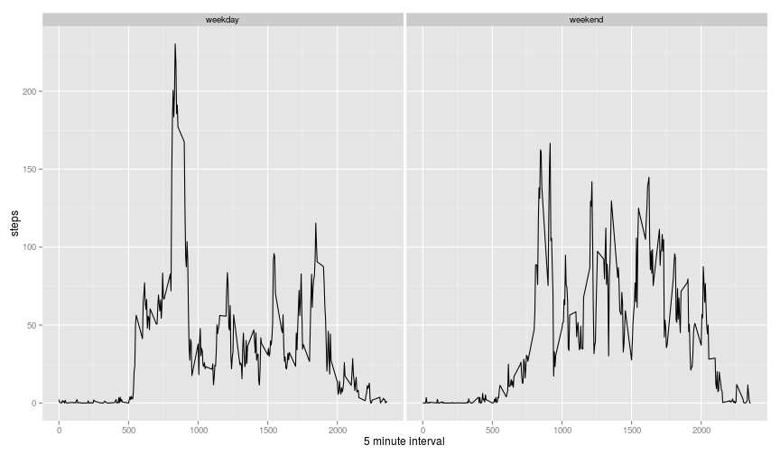

---
output:
  html_document: default
---
# Reproducible Research: Peer Assessment 1


## Loading and preprocessing the data


```r
# unzip the zip file
unzip(zipfile = "activity.zip")
# load the data 
activity <- read.csv("activity.csv", stringsAsFactors = F)
# convert date from string to date
activity$date <- as.Date(activity$date)
```

## What is mean total number of steps taken per day?

**Histogram of the total number of steps taken each day**

```r
library(ggplot2)
steps_per_day <- aggregate(activity$steps, by=list(activity$date), FUN=sum, na.rm=T)
qplot(steps_per_day$x, binwidth=max(steps_per_day$x) / 30, xlab="Total steps in a day")
```

 

**The mean and median total number of steps taken per day**

```r
steps_per_day.mean <- mean(steps_per_day$x)
steps_per_day.median <- median(steps_per_day$x)
sprintf("Mean: %.4f. Median: %.4f", steps_per_day.mean, steps_per_day.median)
```

```
## [1] "Mean: 9354.2295. Median: 10395.0000"
```
The mean is 9354.2295 and the median is 10395

## What is the average daily activity pattern?

**Time series plot of the 5-minute interval (x-axis) and the average number of steps taken, averaged across all days (y-axis)**

```r
avg_steps <- aggregate(activity$steps, by=list(activity$interval), FUN=mean, na.rm=T)
qplot(avg_steps$Group.1, avg_steps$x, geom="line", xlab="5-minutes interval", ylab="average steps")
```

 

**Which 5-minute interval, on average across all the days in the dataset, contains the maximum number of steps?**

```r
max_steps <- max(avg_steps$x)
interval_with_max_steps <- avg_steps$Group.1[avg_steps$x == max(avg_steps$x)]
sprintf("Max steps: %.4f. Corresponding interval: %d", max_steps, interval_with_max_steps)
```

```
## [1] "Max steps: 206.1698. Corresponding interval: 835"
```
The 5-minute interval 835 contains the maximum number of steps, which is 206.1698

## Imputing missing values

**Calculate and report the total number of missing values in the dataset (i.e. the total number of rows with NAs)**

```r
missing_value_count <- nrow(activity[is.na(activity),])
missing_value_count
```

```
## [1] 2304
```
The total number of missing values in the dataset is 2304

**Devise a strategy for filling in all of the missing values in the dataset.**
Use the mean for that 5-minute interval would be a good idea.

To achieve the goal, let's define a function.

```r
imput.na.steps <- function(x, asteps=avg_steps) {
  if (is.na(x[1])) {
    asteps[asteps[,1] == as.integer(x[3]),][1,2]
  } else {
    as.integer(x[1])
  }
}
```
Then use `apply` function to get the imputing value

```r
steps <- apply(activity, 1, imput.na.steps)
```

**Create a new dataset that is equal to the original dataset but with the missing data filled in.**
Create a new variable named `activity_new`

```r
activity_new <- cbind(steps, activity[,c(2,3)])
```

**Make a histogram of the total number of steps taken each day and Calculate and report the mean and median total number of steps taken per day.**

Histogram

```r
steps_per_day_new <- aggregate(activity_new$steps, by=list(activity_new$date), FUN=sum)
qplot(steps_per_day_new$x, binwidth=max(steps_per_day_new$x) / 30, xlab="Total steps in a day")
```

 
Mean and median

```r
steps_per_day_new.mean <- mean(steps_per_day_new$x)
steps_per_day_new.median <- median(steps_per_day_new$x)
sprintf("Mean: %.4f. Median: %.4f", steps_per_day_new.mean, steps_per_day_new.median)
```

```
## [1] "Mean: 10766.1887. Median: 10766.1887"
```
The mean is 1.0766 &times; 10<sup>4</sup> and the median is 1.0766 &times; 10<sup>4</sup>

**Do these values differ from the estimates from the first part of the assignment? What is the impact of imputing missing data on the estimates of the total daily number of steps?**
Yes, these values are different from the estimates from the first part. Imputing missing data reduces the number of 0s. So the histogram is more like a normal activity of a person now.

## Are there differences in activity patterns between weekdays and weekends?

**Create a new factor variable in the dataset with two levels – “weekday” and “weekend” indicating whether a given date is a weekday or weekend day.**

```r
weekend.or.weekday <- function(x) {
  if (weekdays(x) %in% c("Saturday", "Sunday")) {
    "weekend"
  } else {
    "weekday"
  }  
}
weekday <- sapply(activity_new$date, weekend.or.weekday)
activity_new <- cbind(activity_new, weekday)
```

**Make a panel plot containing a time series plot (i.e. type = "l") of the 5-minute interval (x-axis) and the average number of steps taken, averaged across all weekday days or weekend days (y-axis).**


```r
avg_act <- aggregate(activity_new$steps, by=list(activity_new$interval, activity_new$weekday), FUN=mean)

ggplot(avg_act, aes(x=Group.1,y=x)) + geom_line() + facet_grid(. ~ Group.2) + xlab("5 minute interval") + ylab("steps")
```

 


